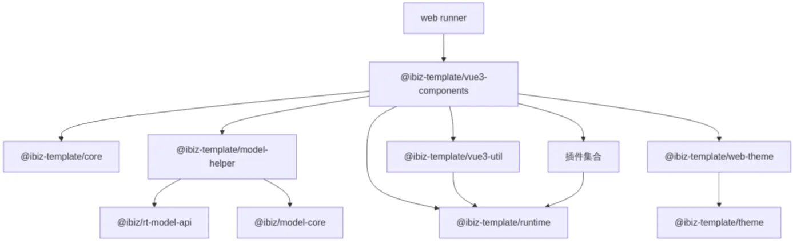
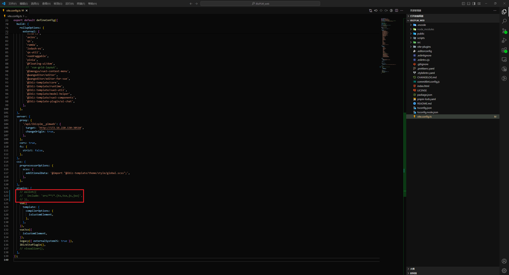

## 简介

iBizPLM前端项目基于iBiz平台产出的模型，采用了模板技术结合Vue全家桶（Vue3、Vite、Element Plus、TSX）来构建。本文档旨在帮助开发人员快速掌握项目的上手流程，并对代码结构进行详细说明，以便提供开发上的指导和支持。随着我们决定将该框架开源，我们热切期望更多有共同理念的伙伴能加入到iBizPLM前端项目的持续迭代和优化中来。欢迎大家的参与，共同推动iBizPLM前端项目的发展！

## 技术栈

### 核心框架

- **Vue 3**：核心框架，提供响应式数据绑定、组件化开发等能力。
- **Vue Router 4**：官方路由管理库，支持动态路由、嵌套路由等功能。
- **Pinia**：轻量级状态管理库，替代 Vuex，支持 TypeScript 和 Composition API。

### UI框架

- **Element Plus**：web端UI框架，基于 Vue 3，面向设计师和开发者的组件库。

### **数据请求**

- **Axios**：流行的 HTTP 请求库，支持拦截器、请求取消等功能。

### **样式**

- **Sass**：CSS 预处理器，增强样式编写能力。

### 国际化

- **Vue I18n**：Vue 官方国际化库，支持多语言切换。

### 工具链

- **Vite**：下一代前端构建工具，提供极快的开发服务器启动和热更新。
- **pnpm**：高效、磁盘空间友好的包管理工具，支持 Monorepo。
- **ESLint**：代码质量检查工具，支持 Vue 3 语法。
- **Prettier**：代码格式化工具，与 ESLint 配合使用。

### 测试工具

- **Vitest**：基于 Vite 的测试框架，支持单元测试和组件测试。

## 核心类库

### 模型层类库

作为框架的核心抽象层，提供标准化的模型接口规范与转换能力：

- 模型规范体系：通过[`@ibiz/model-core`](https://github.com/ibizlab-cloud/ibiz-app-hub/tree/master/models/model-core) 建立统一的前端模型对象接口标准，覆盖应用、视图、部件等核心领域对象。

- 模型转换引擎：[`@ibiz/rt-model-api`](https://github.com/ibizlab-cloud/ibiz-app-hub/tree/master/models/rt-model-api)实现可视化业务建模工具完成建模后的建模数据到运行时模型的编译转换，架起设计与实现的桥梁。

### 核心类库

构建框架基础能力的支柱性模块：

- 基础设施：[`@ibiz-template/core`](https://github.com/ibizlab-cloud/ibiz-app-hub/tree/master/packages/core)提供公共的、通用性的工具、类型定义等基础能力。

- 模型操作：[`@ibiz-template/model-helper`](https://github.com/ibizlab-cloud/ibiz-app-hub/tree/master/packages/model-helper)封装模型动态处理、合并等高级能力。

- 运行时引擎：[`@ibiz-template/runtime`](https://github.com/ibizlab-cloud/ibiz-app-hub/tree/master/packages/runtime)实现从应用中心、应用、视图、部件的完整运行时架构。

- 样式体系：[`@ibiz-template/theme`](https://github.com/ibizlab-cloud/ibiz-app-hub/tree/master/packages/theme)建立基于Sass的样式变量与功能集。

- Vue3通用：[`@ibiz-template/vue3-util`](https://github.com/ibizlab-cloud/ibiz-app-hub/tree/master/packages/vue3-util)提供与Vue3深度集成的组件和工具方法，web端和移动端均可使用。

### UI类库

实现多端适配的呈现层解决方案：

- 主题系统：

Web端：[`@ibiz-template/web-theme`](https://github.com/ibizlab-cloud/ibiz-app-hub/tree/master/components/web-theme)web端主题样式库，提供web端的界面布局模型和主题配置。

- 组件体系：

PC端组件：[`@ibiz-template/vue3-components`](https://github.com/ibizlab-cloud/ibiz-app-hub/tree/master/components/ibiz-next-vue3)基于Element Plus扩展的web端组件库。

### 插件类库

可插拔的业务能力扩展方案：

- 智能交互：[`@ibiz-template-plugin/ai-chat`](https://github.com/ibizlab-cloud/ibiz-app-hub/tree/master/plugins/ibiz-ai-chat)提供AI对话能力。

- 数据可视化：

[`@ibiz-template-plugin/bi-report`](https://github.com/ibizlab-cloud/ibiz-app-hub/tree/master/plugins/ibiz-bi-report)实现动态BI报表。

[`@ibiz-template-plugin/data-view`](https://github.com/ibizlab-cloud/ibiz-app-hub/tree/master/plugins/ibiz-data-view)支持大屏构建。

- 开发工具：[`@ibiz-template/devtool`](https://github.com/ibizlab-cloud/ibiz-app-hub/tree/master/plugins/ibiz-template-devtools)提供可视化调试能力。

## 核心依赖关系图

该体系结构通过分层架构设计，实现了从模型定义(What)到业务实现(How)的完整链路支撑，各层之间通过标准接口解耦，既保证架构稳定性又保持扩展灵活性。



## 成果物结构

```
|─ ─ app
​    |─ ─ public                                 public文件夹
​        |─ ─ assets                             静态文件夹
​        |─ ─ environments                       环境文件
​        |─ ─ extras                             依赖包文件
​        |─ ─ model                              图标元数据文件
​        |─ ─ cas-login.html                     单点登录
        |─ ─ favicon.ico                        应用图标
​    |─ ─ src                                    工程文件夹
        |─ ─ components                         基础组件，主要包含编辑器组件和其他全局使用的组件
        |─ ─ guard                              路由守卫
        |─ ─ model                              模型加载适配器
        |─ ─ publish                            发布模块
            |─ ─ model                          模型模块
​                |─ ─  app                       应用模型
​                |─ ─  code-list                 代码表
​                |─ ─  entities                  实体模型
​                |─ ─  view-config               视图元数据
​                |─ ─  views                     视图模型
            |─ ─ pages                          页面组件
​        |─ ─ main.ts                            入口文件
​        |─ ─ user-register.ts                   自定义组件全局注册
​    |─ ─ vite-plugins                           扩展插件
        ​|─ ─ package.json                       依赖管理文件
        ​|─ ─ tsconfig.json                      TypeScript 项目的主要配置文件
        ​|─ ─ tsconfig.node.json                 Node.js 环境的 TypeScript 配置文件
​        |─ ─ vite.config.ts                     vite 配置文件
```

## 快速上手

### 环境搭建

本地环境需要安装 [pnpm](https://pnpm.io/)、[Node.js](https://nodejs.org/zh-cn)、[Lerna](https://lerna.js.org/) 和 [Git](https://git-scm.com/)。

| 环境  | 版本  |
| ----- | ----- |
| Node  | 18+   |
| pnpm  | 8.x   |
| Lerna | 5.5.2 |

### 安装依赖

打开前端项目，进入工作空间下，执行安装依赖命令

```bash
$ pnpm install
```

### 预览

在工作空间下，执行预览命令

```bash
$ pnpm run preview
```

启动后，预览开发项目。<br>

## 本地开发

### 代码获取

使用Git拉取以下仓库代码

- 核心包：[ibiz-app-hub](https://github.com/ibizlab-cloud/ibiz-app-hub)

### 启动项目

1.进入ibiz-app-hub终端

```
# 安装依赖
pnpm i

# 编译底包
$ pnpm build

# link到全局
$ ./scripts/web-link-global.sh
```
2.进入当前项目终端

```
# 安装依赖
pnpm i
# 添加全局link
pnpm link --global "@ibiz-template/vue3-util"
pnpm link --global "@ibiz-template/model-helper"
pnpm link --global "@ibiz-template/runtime"
pnpm link --global "@ibiz-template/core"
pnpm link --global "@ibiz-template/theme"
pnpm link --global "@ibiz-template/web-theme"
pnpm link --global "@ibiz-template/vue3-components"
# 执行dev
pnpm dev
```

## 更新日志

每个版本的详细更改都记录在[发行说明](CHANGELOG.md)中。

## 如何贡献

如果你希望参与贡献，欢迎 Pull Request，或给我们报告 Bug。

> 强烈推荐阅读 [《提问的智慧》](https://github.com/ryanhanwu/How-To-Ask-Questions-The-Smart-Way)(**本指南不提供此项目的实际支持服务！**)、[《如何向开源社区提问题》](https://github.com/seajs/seajs/issues/545) 和 [《如何有效地报告 Bug》](http://www.chiark.greenend.org.uk/%7Esgtatham/bugs-cn.html)、[《如何向开源项目提交无法解答的问题》](https://zhuanlan.zhihu.com/p/25795393)，更好的问题更容易获得帮助。

## 社区互助

如果您在使用的过程中碰到问题，可以通过下面的途径寻求帮助，同时我们也鼓励资深用户通过下面的途径给新人提供帮助。

- 欢迎加入iBizPLM交流QQ群：1067434627

## 常见问题

### 1. 启动项目时，出现eslint报错，如何解决？
 
   解决方法: 将vite.config.ts部分代码注释，详见下图。<br>
   

### 2. 预览效果和本地开发，界面有一些地方不一致？
 
   解决方法: 不一致的地方大概率是使用插件的地方，插件成果物是SystemJS格式，而开发环境是es格式，2种格式暂时不兼容导致界面不一致。这时我们按需link插件的方式来解决，插件内容和使用方式在plugins子模块中有所描述。


