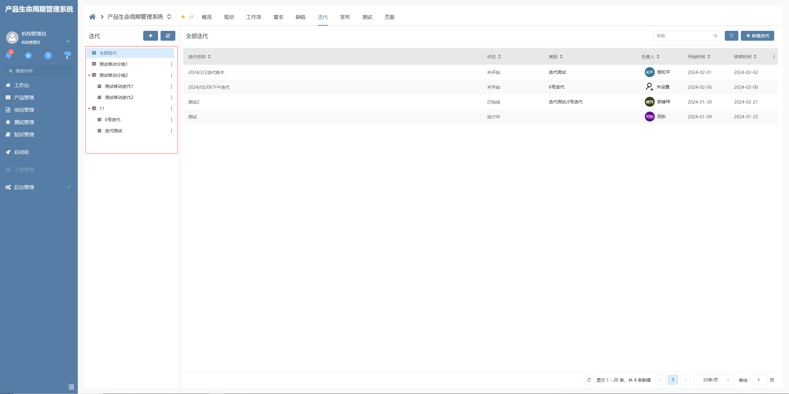

# 分组树

该插件是对树部件的增强，主要用于通过界面逻辑调用插件能力实现树节点自定义增删改。**该插件隶属于树视图绘制插件（基于树部件进行扩展）**

## 页面展示




## 功能说明

### 分组树样式：
  - 区别于模板树样式，该插件特有的样式

### 区分节点分组及节点项：
  - 该插件适配界面逻辑，可以通过界面逻辑调用控制器方法，实现分组与节点的操作

### 新建树节点：
  - 通过界面逻辑调用，type 区分新建节点类型，defaultValue 为向后台请求时携带参数

### 编辑树节点：
  - 通过界面逻辑调用，nodeKey 为当前操作节点的唯一标识，defaultValue 为向后台请求时携带参数

### 删除树节点：
  - 通过界面逻辑调用，nodeKey 为当前操作节点的唯一标识

### 树节点拖拽后默认填充节点数据：
  - 通过在节点关系上配置处理参数的方式指定下级节点填充值，格式为[下级节点要填充的数据字段名称]=[上级节点的数据字段名称]

### 切换草稿导航：
  - 通过界面逻辑调用 changeTreeState 方法，当传递的参数为 draft 时，启用过滤。


## 输入参数

### INewTreeNode (新建树节点)

| 属性名       | 类型     | 默认值 | 描述                                                  |
| ------------ | ------ | ------ |----------------------------------------------------- |
| nodeType     | string  | --      | 区分新增树节点类型为分组或是分组项,根据树节点标识配置 |
| defaultValue | IParams | --      | 新增节点时默认携带参数                                |

### IUpdateTreeNode (编辑树节点)

| 属性名        | 类型    | 默认值 |  描述               | 
| ------------ | ------- | ------ | ------------------ |
| nodeKey      | string  | --      | 树节点唯一标识     |
| defaultValue | IParams | --      | 编辑节点时携带参数 |

### IRemoveTreeNode (删除树节点)

| 属性名  | 类型   | 默认值 | 描述              |
| ------- | ------ | ------ | ----------------- |
| nodeKey | string | --      | 树节点唯一标识 id |

### IChangeTreeState (切换草稿导航)

| 属性名  | 类型   | 默认值 | 描述              |
| ------- | ------ | ------ | ----------------- |
| nodeTag | string | --      | 用于树节点过滤的值  |

### 参数说明（节点参数）

#### 树节点拖拽后默认填充节点数据

通过在节点关系上配置处理参数的方式指定下级节点填充值，格式为[下级节点要填充的数据字段名称]=[上级节点的数据字段名称]

如: `section_id=id`

section_id :为下级节点要填充的数据字段名称
id :为上级节点的数据字段名称


## 部件控制器方法

以下方法可通过界面逻辑直接调用。

| 事件名            | 参数类型          | 参数默认值   | 说明              |
| ---------------- | ----------------- | ----------- | --------------- |
| newTreeNode	     | INewTreeNode      | --      	   | 新建树节点：2 个参数，分别是当前树节点标识, 当前新增节点时携带参数 |
| updateTreeNode	 | IUpdateTreeNode   | --       	 | 编辑指定树节点：2 个参数，分别是当前树节点 id, 当前节点编辑时携带参数 |
| removeTreeNode	 | IRemoveTreeNode   | --       	 | 删除树节点树节点：1 个参数，当前树节点 id |
| changeTreeState	 | IChangeTreeState  | --       	 | 传递参数为 draft 时显示草稿导航 | 1 个参数，用于过滤属于草稿的树节点 |


## 基本使用

在具体项目中，先通过模型导入分组树插件，然后在具体的树部件内选择对应的前端应用插件。

配置树部件时注意树节点配置标识，需要区分分组节点或者是分组项节点。

## 附录

### 树部件插件

```json
[
  {
    "plugintype": "TREE_RENDER",
    "rtobjectrepo": "@ibiz-template-plm/group-tree@0.0.3-alpha.196",
    "codename": "UsrPFPlugin1226747395",
    "plugintag": "GROUP_TREE",
    "rtobjectmode": 2,
    "rtobjectname": "IBizGroupTreeControl",
    "pssyspfpluginname": "分组树"
  }
]
```
