# 跟踪树表格

该插件基于树部件增强，主要是适配业务级树呈现样式，可通过布局面板项配置单元格内容，并且一个布局面板就可以区分需求列、其他关联列。**该插件隶属于树视图绘制插件（基于树部件进行扩展）**


## 页面展示

- 默认显示内容
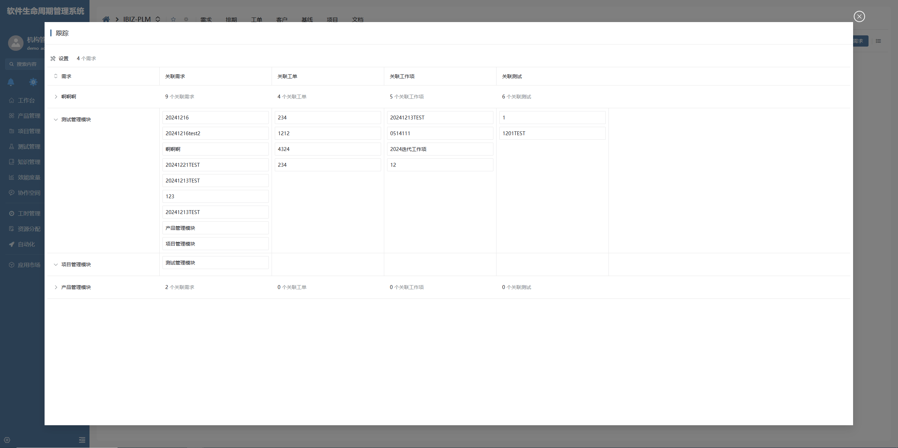
- 配置布局面板后显示内容
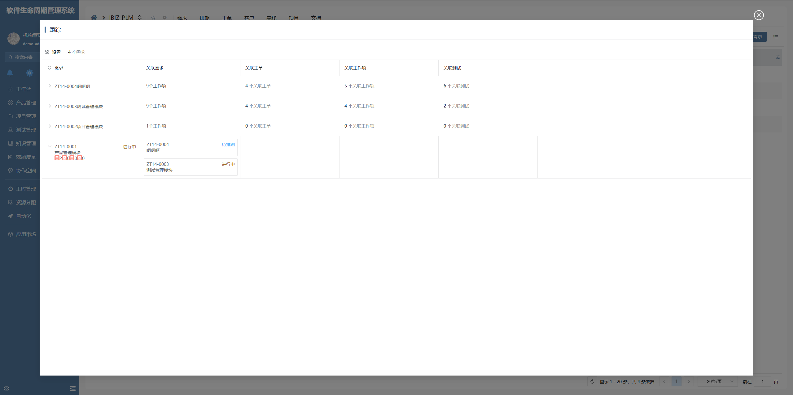

## 功能说明

### 表格列绘制

根据树部件配置的所有静态节点计算得出需要绘制的表格列数量。

### 树动态节点不重复请求后台加载子节点

后台会一次性返回子节点数据，树动态节点配置了用户标记 CUSTOM 时，则当前动态节点下的子节点通过节点标识在自身父节点上获取当前节点需要的数据。避免重复向后台请求。

配置参数

```
CUSTOM
```
配置截图如下：
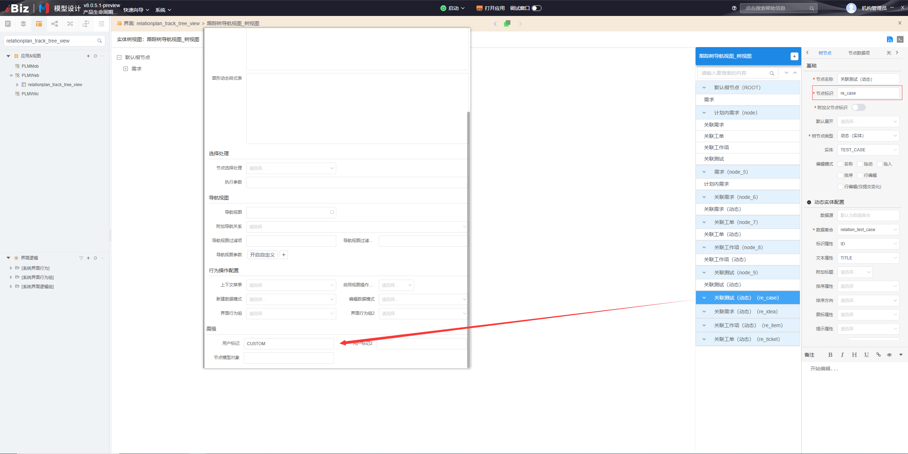

### 表格行展开收起可通过布局面板适配显示单元格内容

在单个布局面板内通过动态逻辑区分展开或收缩。区分逻辑为插件本身适配的，会将区分参数(EXPANDED)传递到面板项data数据内，在布局面板中配置一个隐藏项储存数据，通过界面逻辑控制显示收缩内容或显示展开内容。截图如下：

配置截图如下：
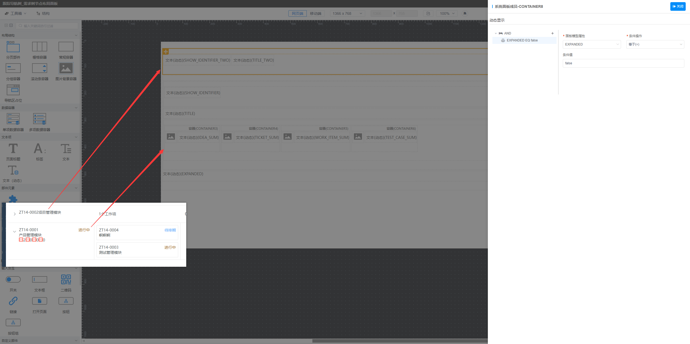


### 可通过布局面板项配置单元格显示内容

布局面板主要分为两大类：需求列，其他关联列。

- 需求列布局面板配置截图：
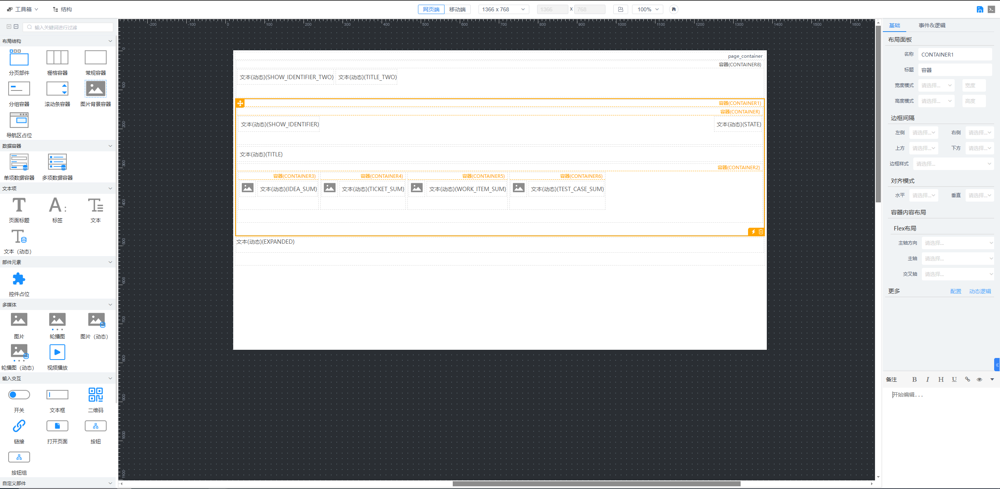
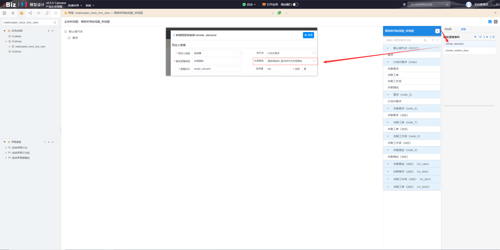

- 其他关联列布局面板配置截图：
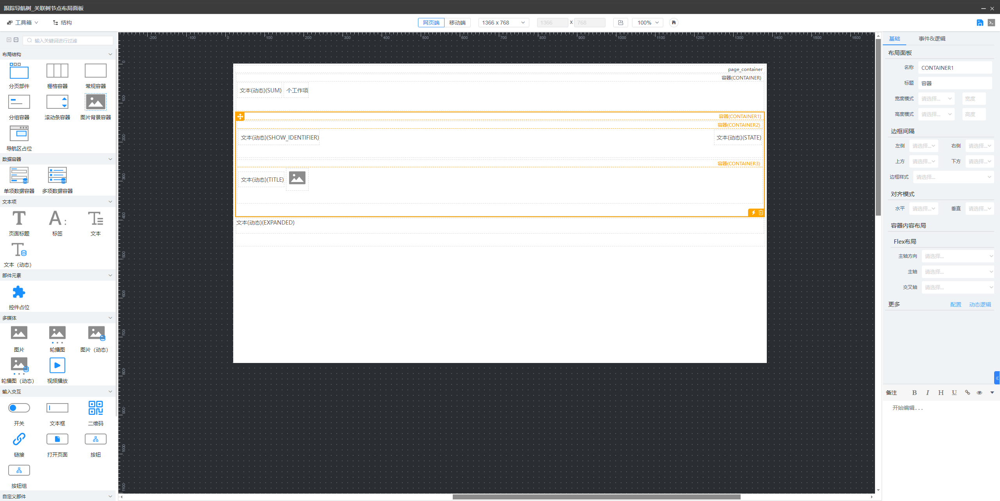
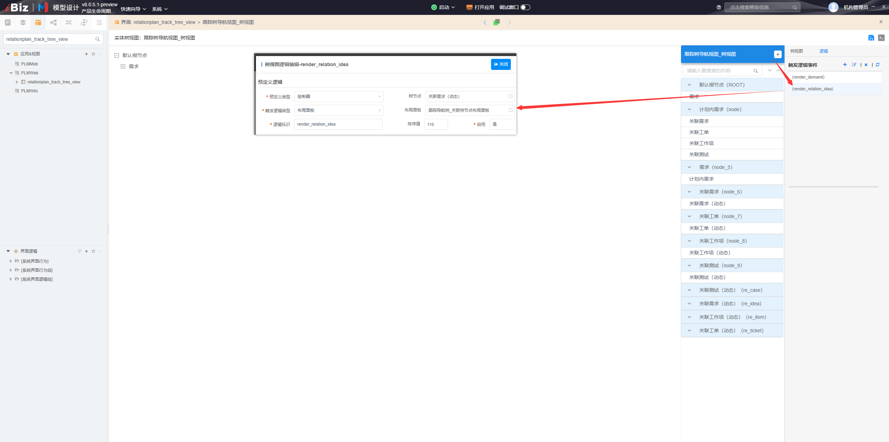

### 启用列设置

在当前静态节点中的用户标记内，配置了ENABLESETTING=true时，此静态节点对应的列可通过设置控制列的显示与隐藏。

配置参数

```
ENABLESETTING=true
```

配置截图如下：
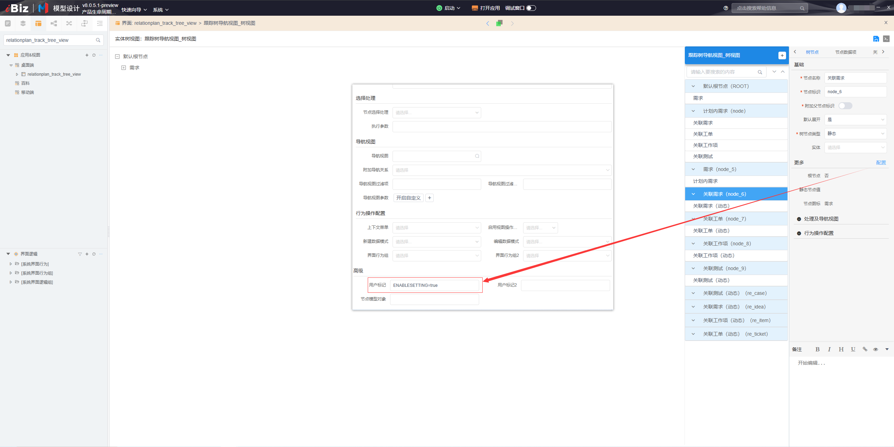

### 列配置图标可配置

- 效果截图
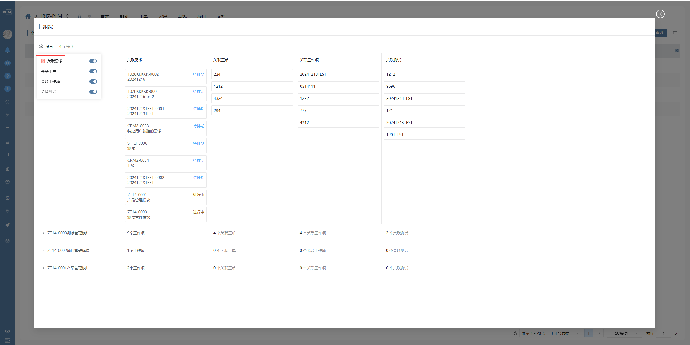
- 配置截图
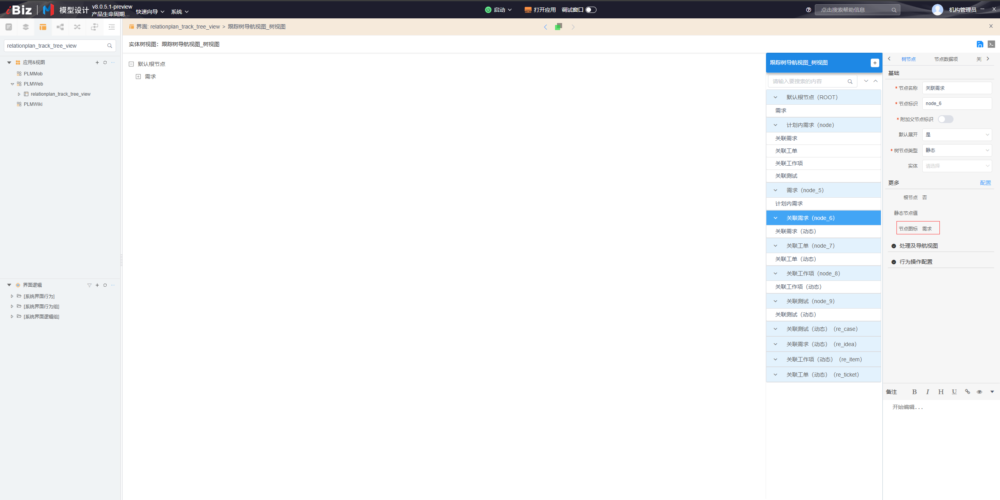


## 附录

### 跟踪树表格插件

```json
[
  {
    "plugintype": "TREE_RENDER",
    "rtobjectrepo": "@ibiz-template-plm/track-tree-grid@0.0.3-alpha.176",
    "codename": "UsrPFPlugin1225439368",
    "plugintag": "TRACK_TREE_GRID",
    "rtobjectmode": 2,
    "rtobjectname": "IBizTrackTreeGridControl",
    "pssyspfpluginname": "跟踪树表格"
  }
]
```